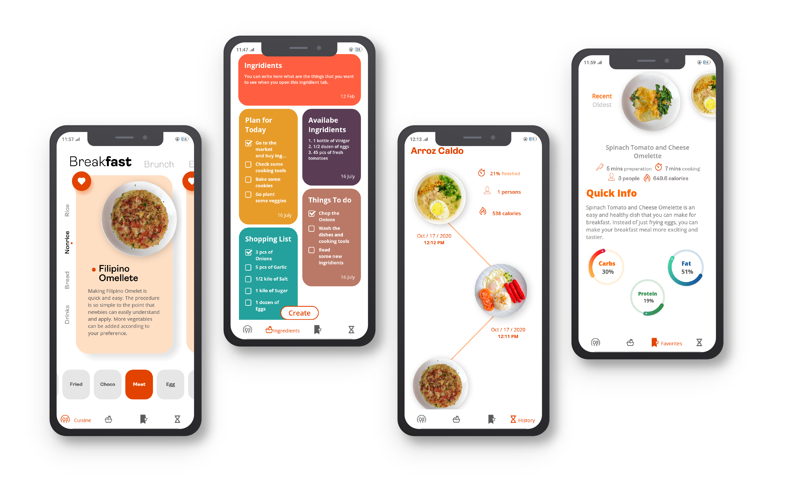

# La Cucina
> Your personal cooking buddy!

So basically this mobile app is for someone that are inlove with cooking foods, this mobile app is a recipe app, but for now it's limited to the foods in my country, Philippiines. This mobile application is not the usual mobile recipe app that you can only see texts, this app is much more interactive and user friendly. If you want to  know more about this app the actual footage of this app is below and the features of it. 

## Key Features
- Filipino Cuisine 
- Adjustable number of serving of people of each recipe 
- Nutrition facts for every recipes
- History of what the user cook
- Notes where the user can record ingridients or other stuff
- Favorite where the user can save all his favorite ingridients

### App Preview

### Colaborating to this repository
if you want to clone or help me with this project, please contact me [here](https://www.facebook.com/ecovillaraza3/) so that we can actually talk about things

### Installation
Once you cloned or download the repository, npm install this inside the directory.
```sh
    npm install @react-navigation/native @react-navigation/stack  react-native-reanimated react-native-gesture-handler react-native-screens react-native-safe-area-context @react-native-community/masked-view @react-navigation/bottom-tabs expo-sqlite expo-font moment
```
